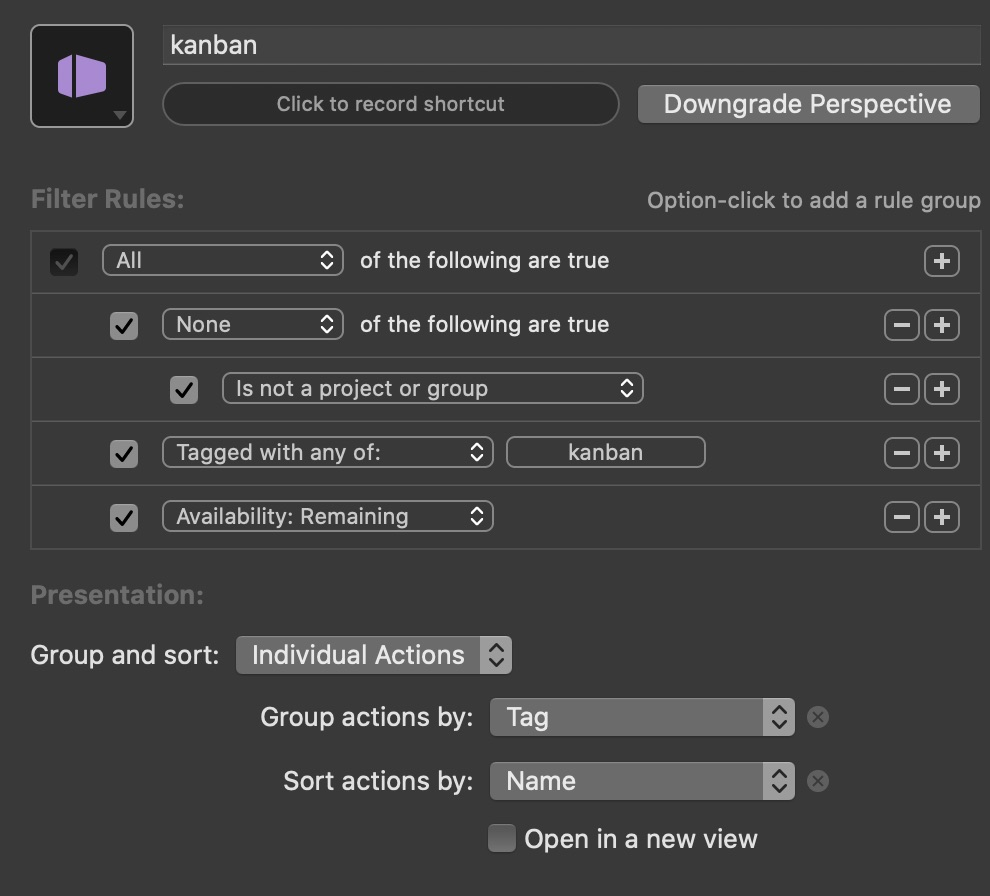

# Project Kanban Board #

This is a copy and tweak of the Omni Automation scripts used to create a Kanban board in OmniFocus. I really wanted it to work on projects vs tasks. Thus, this alteration.

## Installation ##

Download the zip file and follow the same [instructions on the Omni Automation website](https://www.omni-automation.com/omnifocus/plug-in-kanban-board.html).

## Side Note ##

I use a custom perspective to show the Kanban board itself, which is a deviation from the Omni scripts. Here's what that perspective looks like:

